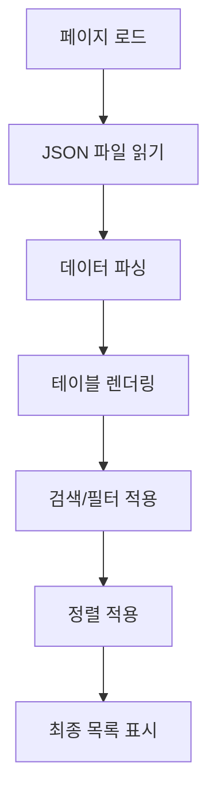
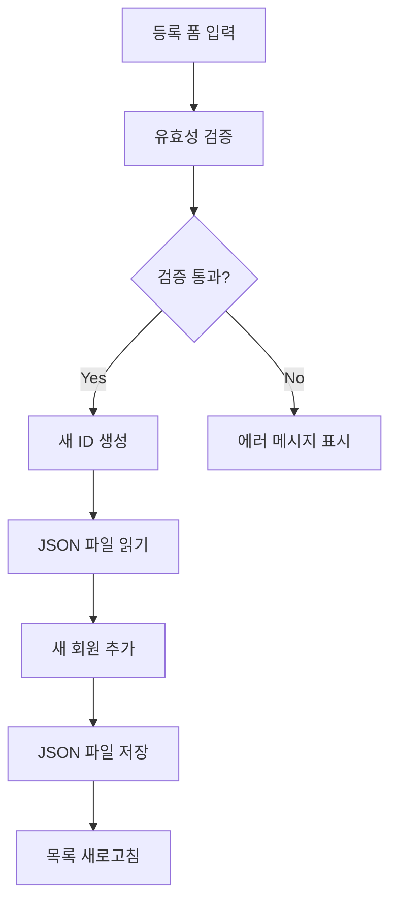
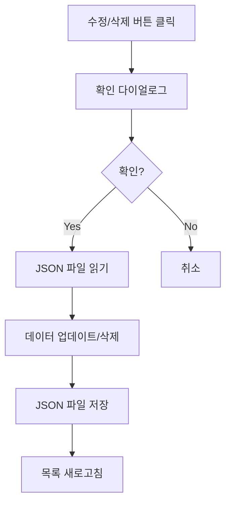

# 🧩 회원 관리 시스템 설계 문서

## 📋 개요
**기능명:** 회원 관리 시스템 (Member Management System)  
**요구사항 출처:** `docs/requirements/001-aco-system-requirements.md`  
**작성 일자:** 2025-01-27  

이 문서는 `회원 관리 시스템` 기능의 상세 설계 문서입니다.  
구성원 정보의 CRUD 기능, 악기/파트 관리, 검색 및 필터링 기능을 포함합니다.

---

## 🎯 설계 원칙
1. **단일 책임 원칙 (SRP)** — 각 컴포넌트는 한 가지 목적에 집중한다.  
2. **데이터 일관성** — JSON 파일 기반 데이터 구조를 명확히 정의한다.  
3. **사용자 경험** — 직관적인 UI로 구성원 정보를 쉽게 관리할 수 있도록 한다.  
4. **확장성** — 향후 데이터베이스 연동을 고려한 구조로 설계한다.  

---

## 🗄️ 데이터베이스 설계

### JSON 파일 구조

#### `/data/members.json`
```json
{
  "members": [
    {
      "id": 1,
      "name": "김민정",
      "instrument": "Fl",
      "part": "1st",
      "remarks": "",
      "createdAt": "2025-01-27T00:00:00Z",
      "updatedAt": "2025-01-27T00:00:00Z"
    },
    {
      "id": 2,
      "name": "박준형",
      "instrument": "Fl",
      "part": "2nd",
      "remarks": "",
      "createdAt": "2025-01-27T00:00:00Z",
      "updatedAt": "2025-01-27T00:00:00Z"
    }
  ],
  "lastId": 11
}
```

#### `/data/instruments.json`
```json
{
  "instruments": [
    {
      "id": 1,
      "name": "플룻",
      "english": "Flute",
      "abbreviation": "Fl"
    },
    {
      "id": 2,
      "name": "오보에",
      "english": "Oboe",
      "abbreviation": "Ob"
    },
    {
      "id": 3,
      "name": "클라리넷",
      "english": "Clarinet",
      "abbreviation": "Cl"
    },
    {
      "id": 4,
      "name": "트럼펫",
      "english": "Trumpet",
      "abbreviation": "Tp"
    },
    {
      "id": 5,
      "name": "호른",
      "english": "Horn",
      "abbreviation": "Hn"
    },
    {
      "id": 6,
      "name": "튜바",
      "english": "Tuba",
      "abbreviation": "Tb"
    }
  ]
}
```

---

## ⚙️ 비즈니스 로직 흐름

### 회원 목록 조회


### 회원 등록


### 회원 수정/삭제


---

## 🔐 보안 및 접근 제어

* **초기 단계:** 파일 기반이므로 서버 측에서 파일 쓰기 권한 관리
* **향후 확장:** 데이터베이스 연동 시 역할 기반 접근 제어 (관리자/일반 사용자)

---

## 🧠 UI/UX 설계 요약

### 페이지 구조
| 페이지 | 주요 컴포넌트 | 설명 |
|--------|--------------|------|
| `/members` | MemberList, MemberForm, MemberTable | 회원 목록 및 관리 페이지 |
| `/members/new` | MemberForm | 회원 등록 페이지 (선택사항) |
| `/members/[id]/edit` | MemberForm | 회원 수정 페이지 (선택사항) |

### 주요 컴포넌트

#### MemberList (회원 목록)
- 검색 바 (이름, 악기로 검색)
- 필터 (악기별, 파트별)
- 정렬 옵션 (이름, 악기, 파트)
- 회원 등록 버튼
- 회원 테이블

#### MemberTable (회원 테이블)
- 컬럼: No., 이름, 악기, 파트, 비고, 액션
- 행별 수정/삭제 버튼
- 반응형 테이블 (모바일 대응)

#### MemberForm (회원 등록/수정 폼)
- 이름 입력 (필수)
- 악기 선택 (드롭다운, 필수)
- 파트 선택 (드롭다운, 선택사항)
- 비고 입력 (텍스트 영역, 선택사항)
- 저장/취소 버튼

---

## 🧪 테스트 항목

| 테스트 항목 | 예상 결과 | 실제 결과 | 상태 |
|------------|----------|----------|------|
| 회원 목록 로드 | JSON 파일에서 데이터 읽어서 표시 | - | ⏳ 대기중 |
| 회원 등록 | 새 회원 추가 후 목록 반영 | - | ⏳ 대기중 |
| 회원 수정 | 기존 정보 수정 후 저장 | - | ⏳ 대기중 |
| 회원 삭제 | 회원 삭제 후 목록에서 제거 | - | ⏳ 대기중 |
| 검색 기능 | 이름/악기로 필터링 | - | ⏳ 대기중 |
| 정렬 기능 | 선택한 기준으로 정렬 | - | ⏳ 대기중 |
| 유효성 검증 | 필수 필드 미입력 시 에러 | - | ⏳ 대기중 |

---

## 📌 Todo DB 등록용 데이터

| 이름 | 분류 | 상태 | 프로젝트 단계 | 우선순위 | 메모 |
|------|------|------|---------------|----------|------|
| 회원 목록 조회 기능 | 👨‍💻 개발 | 🕓 대기중 | 개발 | 높음 | JSON 파일 읽기 및 테이블 렌더링 |
| 회원 등록 기능 | 👨‍💻 개발 | 🕓 대기중 | 개발 | 높음 | 폼 입력 및 JSON 파일 저장 |
| 회원 수정 기능 | 👨‍💻 개발 | 🕓 대기중 | 개발 | 높음 | 기존 정보 수정 및 저장 |
| 회원 삭제 기능 | 👨‍💻 개발 | 🕓 대기중 | 개발 | 높음 | 회원 삭제 및 목록 업데이트 |
| 검색 및 필터링 기능 | 👨‍💻 개발 | 🕓 대기중 | 개발 | 중간 | 이름/악기 검색 및 필터 |
| 정렬 기능 | 👨‍💻 개발 | 🕓 대기중 | 개발 | 낮음 | 이름/악기/파트 기준 정렬 |

> ⚡ Notion Todo DB 정의서 매핑:
>
> * 이름 → Title
> * 분류 → Select(👨‍💻 개발 등)
> * 상태 → Select(진행중/대기중 등)
> * 단계 → Select(기획/개발/테스트 등)
> * 우선순위 → Select(높음/중간/낮음)
> * 메모 → Text

---

## 🧩 참고 문서

* [요구사항 정의서](../requirements/001-aco-system-requirements.md)
* 관련 테스트: `/docs/test-result/member-management-test-result.md`

---

**작성자:** AI Assistant  
**저장경로:** `/docs/features/001-member-management-design.md`  
**작성일자:** 2025-01-27

