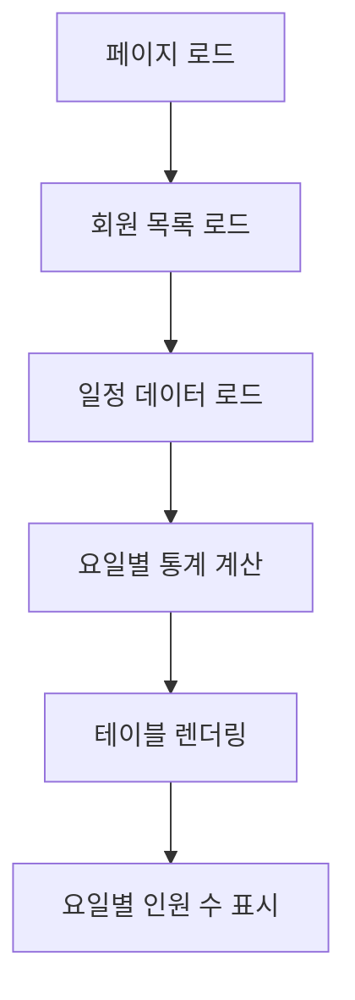
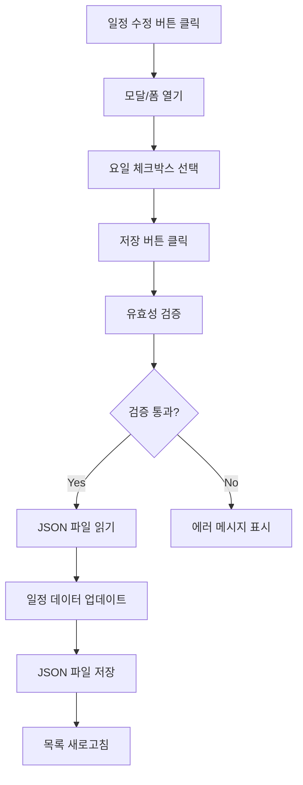
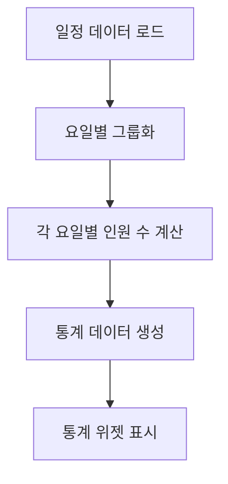
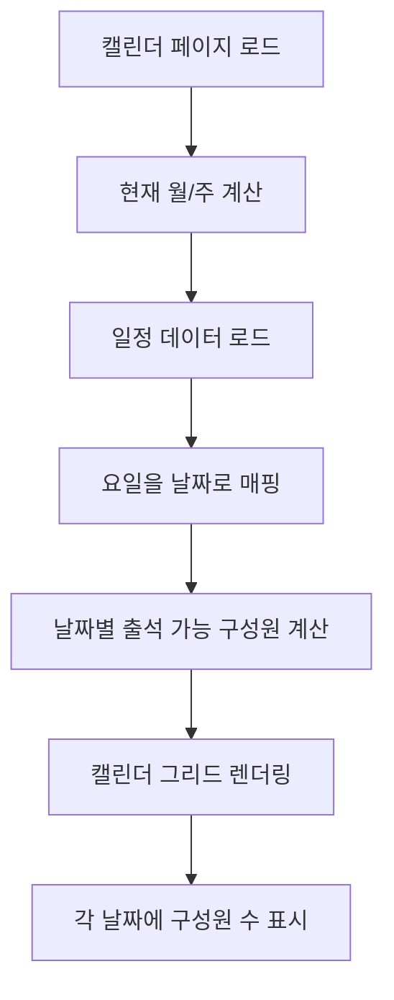
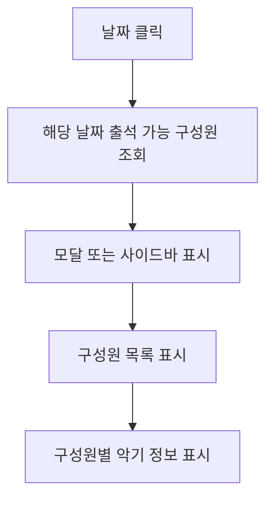

# 🧩 연습일정 관리 시스템 설계 문서

## 📋 개요
**기능명:** 연습일정 관리 시스템 (Practice Schedule Management System)  
**요구사항 출처:** `docs/requirements/001-aco-system-requirements.md`  
**작성 일자:** 2025-01-27  

이 문서는 `연습일정 관리 시스템` 기능의 상세 설계 문서입니다.  
구성원별 출석 가능 일정 등록, 주간 일정 현황 조회, 캘린더 뷰, 통계 정보 표시 기능을 포함합니다.

---

## 🎯 설계 원칙
1. **단일 책임 원칙 (SRP)** — 각 컴포넌트는 한 가지 목적에 집중한다.  
2. **데이터 일관성** — 회원 정보와 일정 정보의 연동을 명확히 한다.  
3. **사용자 경험** — 주간 일정을 한눈에 파악할 수 있는 직관적인 UI 제공.  
4. **시각화** — 캘린더 뷰를 통해 월간/주간 일정을 직관적으로 확인.  
5. **확장성** — 향후 날짜별 상세 일정 관리로 확장 가능한 구조.  

---

## 🗄️ 데이터베이스 설계

### JSON 파일 구조

#### `/data/schedules.json`
```json
{
  "schedules": [
    {
      "memberId": 5,
      "memberName": "한동윤",
      "availableDays": ["목", "금", "토"],
      "weekStartDate": "2025-01-27",
      "updatedAt": "2025-01-27T00:00:00Z"
    },
    {
      "memberId": 7,
      "memberName": "신주안",
      "availableDays": ["화", "수", "토"],
      "weekStartDate": "2025-01-27",
      "updatedAt": "2025-01-27T00:00:00Z"
    },
    {
      "memberId": 1,
      "memberName": "김민정",
      "availableDays": ["화", "수", "목", "토"],
      "weekStartDate": "2025-01-27",
      "updatedAt": "2025-01-27T00:00:00Z"
    },
    {
      "memberId": 10,
      "memberName": "정주희",
      "availableDays": ["목", "금"],
      "weekStartDate": "2025-01-27",
      "updatedAt": "2025-01-27T00:00:00Z"
    },
    {
      "memberId": 4,
      "memberName": "박은경",
      "availableDays": ["화", "목"],
      "weekStartDate": "2025-01-27",
      "updatedAt": "2025-01-27T00:00:00Z"
    }
  ],
  "currentWeek": "2025-01-27"
}
```

### 캘린더 데이터 변환 로직
요일 기반 일정 데이터를 날짜 기반으로 변환하여 캘린더에 표시합니다.

```typescript
interface CalendarEvent {
  date: string; // YYYY-MM-DD 형식
  dayOfWeek: string; // "월", "화", "수", ...
  availableMembers: {
    memberId: number;
    memberName: string;
    instrument: string;
  }[];
  memberCount: number;
}
```

### 요일 매핑
```typescript
const DAYS_OF_WEEK = {
  "월": "Monday",
  "화": "Tuesday",
  "수": "Wednesday",
  "목": "Thursday",
  "금": "Friday",
  "토": "Saturday",
  "일": "Sunday"
} as const;
```

---

## ⚙️ 비즈니스 로직 흐름

### 일정 현황 조회


### 일정 등록/수정


### 통계 계산


### 캘린더 뷰 로드


### 캘린더 날짜 클릭


---

## 🔐 보안 및 접근 제어

* **초기 단계:** 파일 기반이므로 서버 측에서 파일 쓰기 권한 관리
* **향후 확장:** 데이터베이스 연동 시 역할 기반 접근 제어

---

## 🧠 UI/UX 설계 요약

### 페이지 구조
| 페이지 | 주요 컴포넌트 | 설명 |
|--------|--------------|------|
| `/schedules` | ScheduleList, ScheduleTable, ScheduleStats | 주간 일정 현황 페이지 |
| `/schedules/calendar` | CalendarView, CalendarGrid, CalendarEventModal | 캘린더 뷰 페이지 |
| `/schedules/edit` | ScheduleForm | 일정 등록/수정 모달 또는 페이지 |

### 주요 컴포넌트

#### ScheduleList (일정 목록)
- 주간 선택기 (선택사항, 향후 확장)
- 통계 요약 카드
- 일정 테이블
- 일정 수정 버튼

#### ScheduleTable (일정 테이블)
- 컬럼: 이름, 월, 화, 수, 목, 금, 토, 일, 액션
- 각 셀에 체크박스 또는 아이콘으로 출석 가능 여부 표시
- 요일별 헤더에 인원 수 표시

#### ScheduleStats (통계 위젯)
- 요일별 출석 가능 인원 수
- 주간 평균 출석 가능 인원
- 구성원별 주간 출석 가능 일수 (선택사항)

#### ScheduleForm (일정 등록/수정 폼)
- 구성원 선택 (드롭다운 또는 자동완성)
- 요일 체크박스 (월~일)
- 저장/취소 버튼

#### CalendarView (캘린더 뷰)
- 월간/주간 뷰 전환 버튼
- 이전/다음 월/주 네비게이션
- 오늘 날짜 하이라이트
- 현재 월/주 표시

#### CalendarGrid (캘린더 그리드)
- 월간 뷰: 7일 × 5-6주 그리드
- 주간 뷰: 7일 × 1주 그리드
- 각 날짜 셀에 출석 가능 인원 수 표시
- 날짜 클릭 시 상세 정보 모달 표시
- 출석 가능 인원이 많은 날짜는 색상 강조 (선택사항)

#### CalendarEventModal (캘린더 이벤트 모달)
- 선택한 날짜의 출석 가능 구성원 목록
- 구성원별 이름, 악기, 파트 정보 표시
- 악기별 그룹화 표시 (선택사항)
- 모달 닫기 버튼

---

## 🧪 테스트 항목

| 테스트 항목 | 예상 결과 | 실제 결과 | 상태 |
|------------|----------|----------|------|
| 일정 목록 로드 | JSON 파일에서 데이터 읽어서 표시 | - | ⏳ 대기중 |
| 일정 등록 | 새 일정 추가 후 목록 반영 | - | ⏳ 대기중 |
| 일정 수정 | 기존 일정 수정 후 저장 | - | ⏳ 대기중 |
| 통계 계산 | 요일별 인원 수 정확히 계산 | - | ⏳ 대기중 |
| 요일별 표시 | 체크박스/아이콘으로 정확히 표시 | - | ⏳ 대기중 |
| 회원 연동 | 회원 정보와 일정 정보 정확히 연동 | - | ⏳ 대기중 |
| 캘린더 뷰 표시 | 월간/주간 캘린더 그리드 렌더링 | - | ⏳ 대기중 |
| 날짜별 구성원 표시 | 각 날짜에 출석 가능 인원 수 정확히 표시 | - | ⏳ 대기중 |
| 날짜 클릭 이벤트 | 날짜 클릭 시 상세 정보 모달 표시 | - | ⏳ 대기중 |
| 월/주 네비게이션 | 이전/다음 월/주 이동 기능 | - | ⏳ 대기중 |

---

## 📌 Todo DB 등록용 데이터

| 이름 | 분류 | 상태 | 프로젝트 단계 | 우선순위 | 메모 |
|------|------|------|---------------|----------|------|
| 일정 현황 조회 기능 | 👨‍💻 개발 | 🕓 대기중 | 개발 | 높음 | 주간 일정 테이블 및 통계 표시 |
| 일정 등록/수정 기능 | 👨‍💻 개발 | 🕓 대기중 | 개발 | 높음 | 구성원별 출석 가능 요일 등록 |
| 통계 계산 기능 | 👨‍💻 개발 | 🕓 대기중 | 개발 | 중간 | 요일별 인원 수 계산 및 표시 |
| 캘린더 뷰 기능 | 👨‍💻 개발 | 🕓 대기중 | 개발 | 높음 | 월간/주간 캘린더로 일정 시각화 |
| 캘린더 그리드 컴포넌트 | 👨‍💻 개발 | 🕓 대기중 | 개발 | 높음 | 날짜별 출석 가능 인원 표시 |
| 캘린더 이벤트 모달 | 👨‍💻 개발 | 🕓 대기중 | 개발 | 중간 | 날짜 클릭 시 상세 정보 표시 |
| 월/주 네비게이션 | 👨‍💻 개발 | 🕓 대기중 | 개발 | 중간 | 이전/다음 월/주 이동 기능 |
| 주간 선택 기능 | 👨‍💻 개발 | 🕓 대기중 | 개발 | 낮음 | 주간 단위 일정 관리 (향후 확장) |

> ⚡ Notion Todo DB 정의서 매핑:
>
> * 이름 → Title
> * 분류 → Select(👨‍💻 개발 등)
> * 상태 → Select(진행중/대기중 등)
> * 단계 → Select(기획/개발/테스트 등)
> * 우선순위 → Select(높음/중간/낮음)
> * 메모 → Text

---

## 🧩 참고 문서

* [요구사항 정의서](../requirements/001-aco-system-requirements.md)
* [회원 관리 시스템 설계](../features/001-member-management-design.md)
* 관련 테스트: `/docs/test-result/schedule-management-test-result.md`

---

**작성자:** AI Assistant  
**저장경로:** `/docs/features/002-schedule-management-design.md`  
**작성일자:** 2025-01-27

