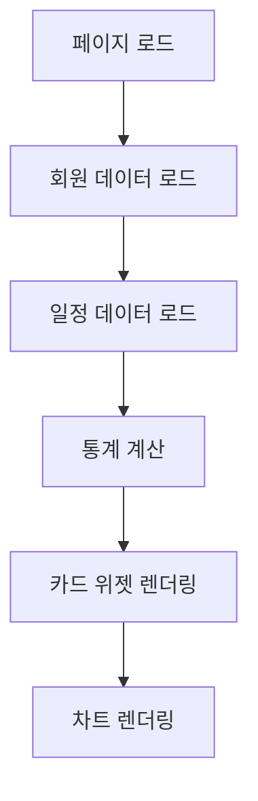
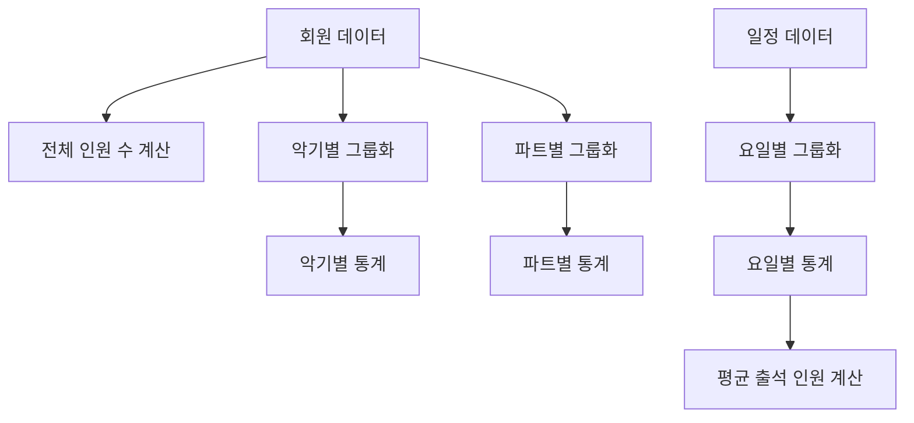

# 🧩 대시보드 설계 문서

## 📋 개요
**기능명:** 대시보드 (Dashboard)  
**요구사항 출처:** `docs/requirements/001-aco-system-requirements.md`  
**작성 일자:** 2025-01-27  

이 문서는 `대시보드` 기능의 상세 설계 문서입니다.  
전체 구성원 현황, 악기별/파트별 통계, 주간 연습일정 요약 정보를 제공합니다.

---

## 🎯 설계 원칙
1. **정보 밀도** — 핵심 정보를 한눈에 파악할 수 있도록 구성.  
2. **시각화** — 통계 정보를 카드, 차트 등으로 직관적으로 표시.  
3. **실시간성** — 최신 데이터를 반영하여 표시.  
4. **확장성** — 향후 추가 지표를 쉽게 추가할 수 있는 구조.  

---

## 🗄️ 데이터베이스 설계

### 데이터 소스
대시보드는 다음 JSON 파일들을 읽어서 통계를 계산합니다:
- `/data/members.json` - 회원 정보
- `/data/instruments.json` - 악기 정보
- `/data/schedules.json` - 일정 정보

### 통계 데이터 구조
```typescript
interface DashboardStats {
  totalMembers: number;
  instrumentStats: {
    [key: string]: number; // 악기 약식 -> 인원 수
  };
  partStats: {
    [key: string]: number; // 파트 -> 인원 수
  };
  weeklySchedule: {
    [key: string]: number; // 요일 -> 출석 가능 인원 수
  };
  averageAttendance: number; // 주간 평균 출석 가능 인원
}
```

---

## ⚙️ 비즈니스 로직 흐름

### 대시보드 로드


### 통계 계산 로직


---

## 🔐 보안 및 접근 제어

* **초기 단계:** 읽기 전용 데이터 표시
* **향후 확장:** 역할별 대시보드 커스터마이징

---

## 🧠 UI/UX 설계 요약

### 페이지 구조
| 페이지 | 주요 컴포넌트 | 설명 |
|--------|--------------|------|
| `/` 또는 `/dashboard` | Dashboard, StatsCard, StatsChart | 메인 대시보드 페이지 |

### 주요 컴포넌트

#### Dashboard (대시보드 메인)
- 헤더 (제목, 새로고침 버튼)
- 통계 카드 그리드
- 차트 섹션 (선택사항)
- 최근 활동 섹션 (선택사항)

#### StatsCard (통계 카드)
- 전체 구성원 수 카드
- 악기별 통계 카드
- 파트별 통계 카드
- 주간 일정 요약 카드

#### StatsChart (통계 차트)
- 악기별 분포 차트 (막대 그래프 또는 파이 차트)
- 파트별 분포 차트
- 주간 출석 현황 차트 (선 그래프)

---

## 🧪 테스트 항목

| 테스트 항목 | 예상 결과 | 실제 결과 | 상태 |
|------------|----------|----------|------|
| 통계 데이터 로드 | JSON 파일에서 데이터 읽어서 통계 계산 | - | ⏳ 대기중 |
| 전체 인원 수 표시 | 정확한 인원 수 표시 | - | ⏳ 대기중 |
| 악기별 통계 표시 | 악기별 인원 수 정확히 계산 및 표시 | - | ⏳ 대기중 |
| 파트별 통계 표시 | 파트별 인원 수 정확히 계산 및 표시 | - | ⏳ 대기중 |
| 주간 일정 요약 | 요일별 출석 가능 인원 수 표시 | - | ⏳ 대기중 |
| 차트 렌더링 | 통계 데이터를 차트로 시각화 | - | ⏳ 대기중 |

---

## 📌 Todo DB 등록용 데이터

| 이름 | 분류 | 상태 | 프로젝트 단계 | 우선순위 | 메모 |
|------|------|------|---------------|----------|------|
| 대시보드 레이아웃 구성 | 👨‍💻 개발 | 🕓 대기중 | 개발 | 높음 | 통계 카드 및 레이아웃 구성 |
| 통계 계산 로직 | 👨‍💻 개발 | 🕓 대기중 | 개발 | 높음 | 회원/일정 데이터 기반 통계 계산 |
| 통계 카드 컴포넌트 | 👨‍💻 개발 | 🕓 대기중 | 개발 | 중간 | 각 통계 항목별 카드 위젯 |
| 차트 컴포넌트 | 👨‍💻 개발 | 🕓 대기중 | 개발 | 낮음 | 통계 데이터 시각화 (선택사항) |

> ⚡ Notion Todo DB 정의서 매핑:
>
> * 이름 → Title
> * 분류 → Select(👨‍💻 개발 등)
> * 상태 → Select(진행중/대기중 등)
> * 단계 → Select(기획/개발/테스트 등)
> * 우선순위 → Select(높음/중간/낮음)
> * 메모 → Text

---

## 🧩 참고 문서

* [요구사항 정의서](../requirements/001-aco-system-requirements.md)
* [회원 관리 시스템 설계](../features/001-member-management-design.md)
* [연습일정 관리 시스템 설계](../features/002-schedule-management-design.md)
* 관련 테스트: `/docs/test-result/dashboard-test-result.md`

---

**작성자:** AI Assistant  
**저장경로:** `/docs/features/003-dashboard-design.md`  
**작성일자:** 2025-01-27

